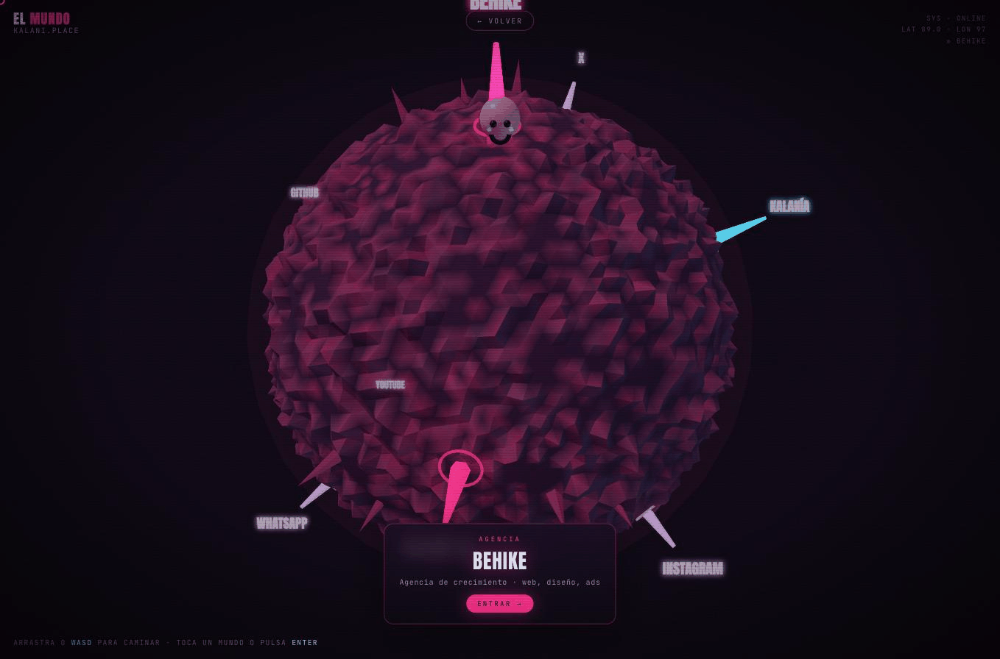

# Kalani André 🇵🇷

Construyo **Empleados de IA** para negocios reales y enseño IA en español.

Founder @ [Behike](https://behike.co) · Computer Engineering @ PUPR · vibe coding en español

  

Camina mi sitio como un planeta 3D → <a href="https://kalani.place/mundo"><b>kalani.place/mundo</b></a>

## Qué construyo

- 🤖 [**behike.ai**](https://behike.ai): Empleados de IA para empresas, entrenados en tu operación real
- 🧠 [**three-memory**](https://github.com/kalaniandrez/three-memory): mi framework de memoria para agentes de IA que no olvidan quiénes son
- 🎙️ [**transcribe**](https://github.com/kalaniandrez/transcribe): transcripción offline afinada para español caribeño, con guardia anti alucinaciones
- 🔀 [**ai-bridge**](https://github.com/kalaniandrez/ai-bridge): Claude, Codex y Gemini consultándose entre sí desde la terminal
- 🌳 [**keep-building**](https://github.com/kalaniandrez/keep-building): cuando una IA llega a su límite, checkpoint y le pasas el mismo repo a la próxima

## Dónde enseño

📚 IA en español, paso a paso, sin humo: [@kalaniandrez](https://www.instagram.com/kalaniandrez) en Instagram, YouTube y TikTok.

## Todo en un solo lugar

🌐 [**kalani.place**](https://kalani.place)

I build AI employees for real businesses in Puerto Rico and teach AI in Spanish. Everything lives at <a href="https://kalani.place">kalani.place</a>.
